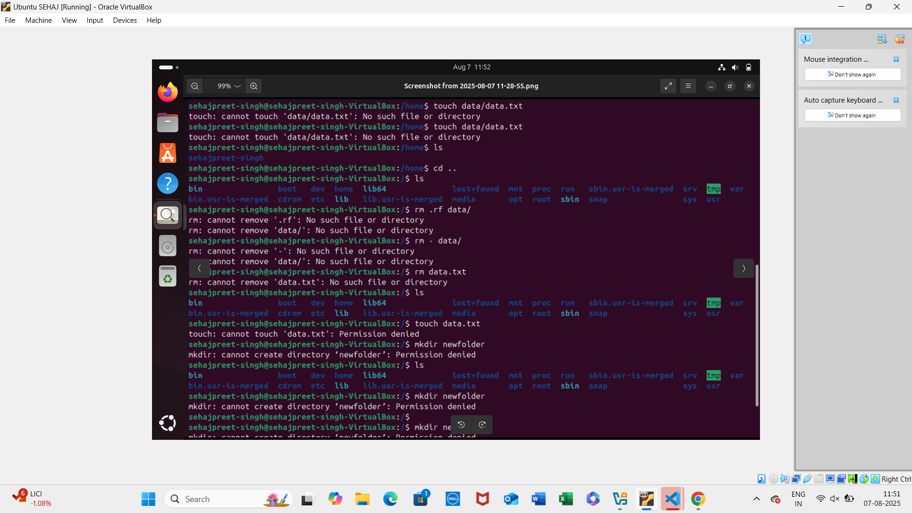

Here's a Markdown (`.md`) file that documents the usage of `rm`, `cp`, and `touch`, and includes:

* A simple example of moving one file to another using `mv`
* An example of `rm -rf`

---

### 📁 File: `file_commands.md`

````markdown
# Basic Linux File Commands

This document provides an overview and examples of basic file management commands in Linux: `rm`, `cp`, `touch`, and `mv`.

---

## 🧹 `rm` – Remove Files or Directories

### Syntax:
```bash
rm [options] file...
````

### Common Options:

* `-r` : Recursively delete directories and their contents.
* `-f` : Force deletion without prompting for confirmation.

### Example – Remove a single file:

```bash
rm file.txt
```

### Example – Force remove a directory and its contents:

```bash
rm -rf /path/to/directory
```

⚠️ **Warning:** `rm -rf` is a dangerous command — it will delete everything in the directory without asking. Use with caution.

---

## 📄 `cp` – Copy Files or Directories

### Syntax:

```bash
cp [options] source destination
```

### Common Options:



* `-r` : Recursively copy directories.

### Example – Copy a file:

```bash
cp original.txt backup.txt
```

### Example – Copy a folder recursively:

```bash
cp -r folder1/ folder2/
```

---

## ✨ `touch` – Create an Empty File or Update Timestamps

### Syntax:

```bash
touch filename
```

### Example – Create a new empty file:

```bash
touch newfile.txt
```

---

## 🚚 `mv` – Move or Rename Files

### Syntax:

```bash
mv source destination
```

### Example – Move (rename) a file:

```bash
mv file1.txt file2.txt
```

This renames `file1.txt` to `file2.txt` or moves it to a different location if the destination is a directory.

---

## 🔚 Summary

| Command  | Description              | Example              |
| -------- | ------------------------ | -------------------- |
| `rm`     | Remove files             | `rm file.txt`        |
| `rm -rf` | Force remove recursively | `rm -rf /mydir`      |
| `cp`     | Copy files               | `cp a.txt b.txt`     |
| `cp -r`  | Copy directories         | `cp -r dir1 dir2`    |
| `touch`  | Create empty file        | `touch test.txt`     |
| `mv`     | Move or rename file      | `mv old.txt new.txt` |

---

📌 **Note:** Always double-check file paths when using destructive commands like `rm -rf`.

```

---

Would you like me to export this as a downloadable `.md` file?
```
