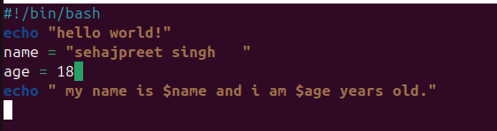
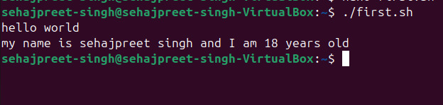
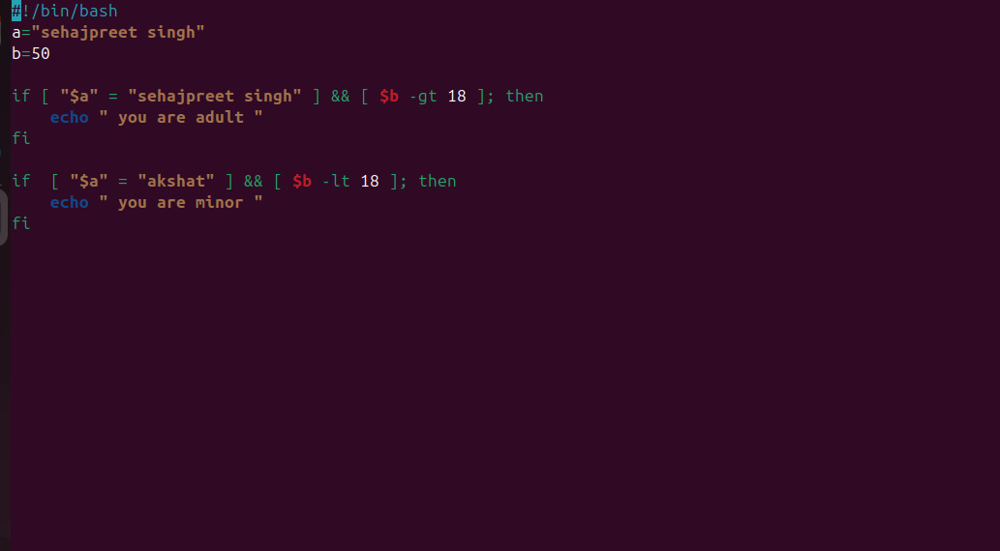
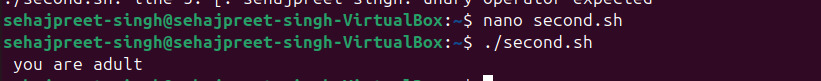

# 🔧understanding how existing scripts in repo work

# 🔧script 1

  ```
 #!/bin/bash      - shebang
 echo "hello world!"     - printing hello world
 name="sehajpreet singh"   - taking sehajpreet singh in variable name
 age=18    -  taking 18 in variable age 

 echo "My name is $name ansd I am $age year old."  - printing name and age
```
#### OUTPUT :



# 🔧 script 2

```
#!/bin/bash        -shebang
a="sehajpreet singh"           -taking sehajpreet singh in the variable a
b=40                 -taking 40 in the variable b

if [ $a="sehajpreet singh" ] && [ $b -gt 18 ]; then      -checking conditions and using an opreator and(&&)
    echo " you are adult "                     - printing you are adult
fi

if [ $a=" akshat" ] && [ $b -lt 18 ]; then       -checking conditions and using an opreator and(&&)
    echo "you are minor"                         - printing you are minor
fi

```


### 🔧 Q1 what is the purpose of #!/bin/bash at the top of the script

ANS-- the shebang line at the top of a script specifies the interpreter that should be used to the run the script.

### 🔧 Q2 how do you make a script executable?
ANS-- 1. add the shebang at the top
          2. give permission using the chmod command
          3. run the code.